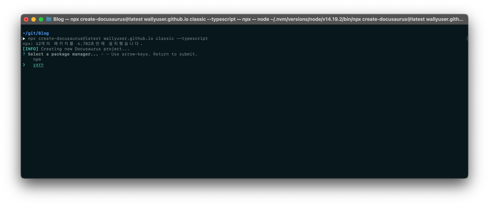
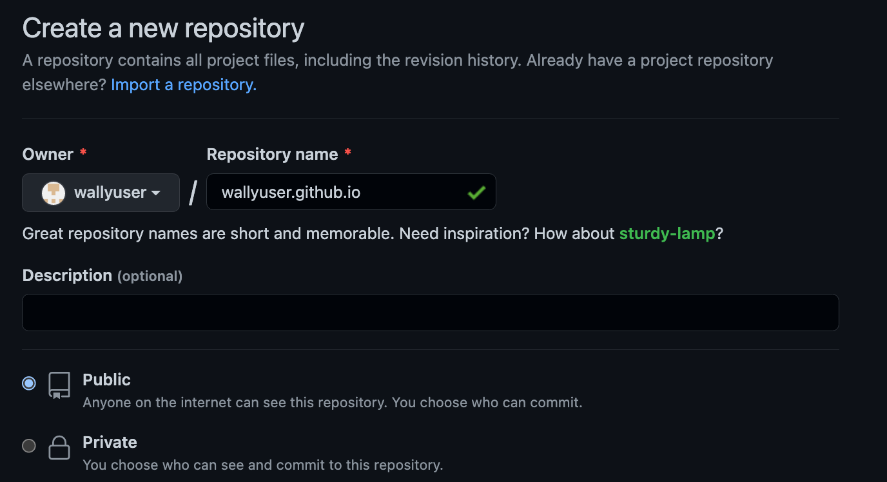
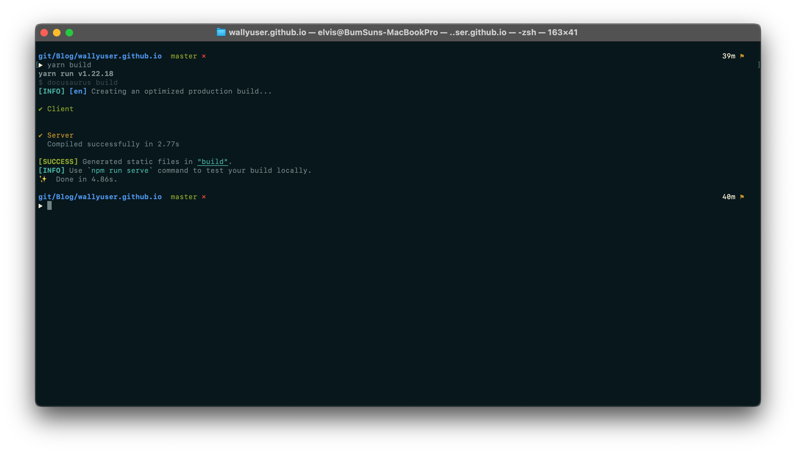
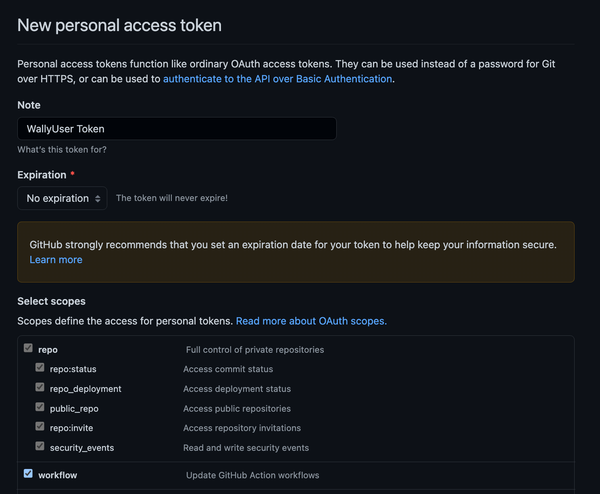
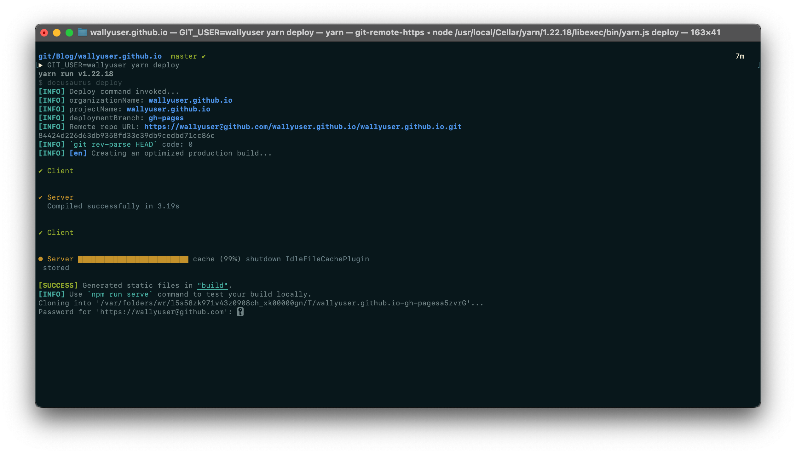
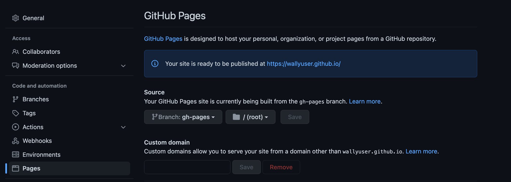
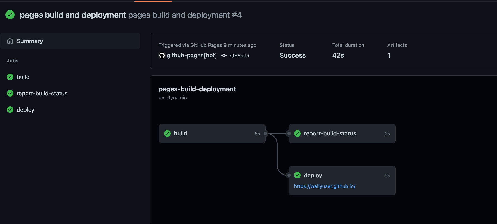

사실 예전부터 Tistroy 블로그를 운영하였다. Tistory에서 글을 작성할 때, 내가 사용하는 스킨에 따라 개성 있는 글을 작성할 수 있다는 장점 때문에 사용하였다.
하지만, 해당 스킨은 내가 직접 만든 것이 아니기 때문에, 스킨 배포자의 라이선스 정책 변경이나, 업데이트 중단 등의 문제가 발생하였을 경우 
지금까지 작성한 게시물에 대한 수정도 필요하고 귀찮아 질 것 같았다.

<!--truncate-->

그리고 포스팅이란 나의 경험을 글로 써 내려가는 것이기 가급적 똥글 작성을 지양해야 하는데, 똥글이 되지 않기 위해서는 콘텐츠의 구성과 내용의 정확성도 포함되지만 가독성도 중요하다고 생각한다.
그래서 마크다운(Markdown)을 지원하는 Git Pages를 이용하고자 이주하였다. ~~(티스토리도 마크다운을 지원하지만... 뭔가 불편)~~

## Docusaurus를 선택한 이유
Git Pages를 생성하려고 할 때... 가장 먼저 작업했던 것은 스킨 선택이였다. ~~(디자이너도 아닌 놈이 비주얼에만 꽂혀서는)~~
Jekyll이나 Hexo등의 스킨을 보았으나 뭔가 하나씩 맘에 들지 않았다. 그렇다고 Docusaurus가 100% 맘에 든 것은 아니지만... 
적어도 지금까지 보았단 Jekyll이나 Hexo등처럼 스킨 고민하느라 시간 날리지는 않을 것 같았다.

## Docusaurus GitPages 생성
Docusaurus는 v1과 v2(현재 베타) 가 있으며, v1은 조만간 **Deprecated** 될 예정이며, 공식 홈페이지에서도 v2로 할 것을 적극적인 권장하고 있다.
Docusaurus로 Git Pages를 생성하기 위해서는 **Node 14 이상 버전이 필요**하다. 


### 초기 설정
아래 명령어를 입력하여 Docusaurus를 설치하기 위한 뼈대를 만들어주는 명령행 도구를 사용한다. 
```
npx create-docusaurus@latest my-website classic --typescript
```

위 명령어의 **my-website** 에는 자유롭게 작성하면 된다.
Docusaurus는 타입스크립트 테마 컴포넌트를 작성하고 사용하는 것을 지원한다. Git Pages에서 타입스크립트를 이용한 설정을 할 예정이라면 
**--typescript** 옵션을 추가한다. 
만약, Dosaurus v1에서 사용하던 기능을 사용하려면 **classic** 옵션을 사용하여 classic 템플릿을 사용할 수 있다. 

나는 아래와 같이 작성하였다. 

```
npx create-docusaurus@latest wallyuser.github.io classic --typescript
```

만약 node 버전이 14버전보다 낮을 경우 **npx: ~개의 패키지를 ~~초만에 설치했습니다.** 라는 문구만 출력되고 실제로는 설치되지 않는다.
또한, 설치하려는 PC에 npm과 yarn이 둘다 설치되어 있을 경우 알래와 같이 어떤 패키지 관리 툴로 설치할지 물어본다. 여기서는 yarn으로 진행한다.



패키지 관리 툴을 선택하면, 자동으로 진행이 완료된다.

### 로컬 서버 실행

아래 명령으로 로컬에서 서버를 실행할 수 있다. 접속은 http://localhost:3000 으로 할 수 있다. 

```
cd wallyuser.github.io
npm run start
```

### Git Repository 생성
깃허브에서 Docusaurus 소스를 보관할 레파지토리를 생성한다.

### 최초 커밋

레파지토리를 생성하면 표시되는 가이드에 따라 Docusaurus 소스를 commit & push 한다.

```git
git init
git add --all
git commit -m "first commit"
git branch -M master
git remote add origin https://github.com/wallyuser/wallyuser.github.io.git
git push -u origin master
```

### GitPages 자동배포 구성하기
먼저 docusaurus.config.js 파일을 열어 아레와 같이 설정한다.

> docusaurus.config.js

```js
const config = {
  title: 'WallyUser',  // 자유롭게 작성
  tagline: 'WallyUser Blog', // 지유롭게 작성
  url: 'https://wallyuser.github.io', // 본인의 gitPages URL
  baseUrl: '/',
  onBrokenLinks: 'warn', // 기본값은 throw
  onBrokenMarkdownLinks: 'warn',
  favicon: 'img/favicon.ico',
  organizationName: 'wallyuser', // Github 유저명.
  projectName: 'wallyuser.github.io', // Github repository 명.
  deploymentBranch: 'gh-pages', // 빌드후 자동으로 배포될 브런치.
  trailingSlash: false, 
  ...

```
자동배포를 위해 root 경로에 .github/workflows 디렉터리를 생성한다.
그 다음 deploy.yml 파일을 생성하여 아래와 같이 작성한다. 
해당 내용은 [여기](https://docusaurus.io/ko/docs/deployment#triggering-deployment-with-github-actions)에서 확인할 수 있으며, 해당 사이트에 있는 내용 그대로 붙여넣는다.
> .github/workflows/deploy.yml

```yml
name: Deploy to GitHub Pages

on:
  push:
    branches:
      - master
    # Review gh actions docs if you want to further define triggers, paths, etc
    # https://docs.github.com/en/actions/using-workflows/workflow-syntax-for-github-actions#on

jobs:
  deploy:
    name: Deploy to GitHub Pages
    runs-on: ubuntu-latest
    steps:
      - uses: actions/checkout@v2
      - uses: actions/setup-node@v3
        with:
          node-version: 16.x
          cache: yarn

      - name: Install dependencies
        run: yarn install --frozen-lockfile
      - name: Build website
        run: yarn build

      # Popular action to deploy to GitHub Pages:
      # Docs: https://github.com/peaceiris/actions-gh-pages#%EF%B8%8F-docusaurus
      - name: Deploy to GitHub Pages
        uses: peaceiris/actions-gh-pages@v3
        with:
          github_token: ${{ secrets.GITHUB_TOKEN }}
          # Build output to publish to the `gh-pages` branch:
          publish_dir: ./build
          # The following lines assign commit authorship to the official
          # GH-Actions bot for deploys to `gh-pages` branch:
          # https://github.com/actions/checkout/issues/13#issuecomment-724415212
          # The GH actions bot is used by default if you didn't specify the two fields.
          # 자신의 자격증명으로 교체할 수 있습니다.
          user_name: github-actions[bot]
          user_email: 41898282+github-actions[bot]@users.noreply.github.com
```

**deploy.yml** 의 Node 버전(16.x)과 현재 사용하고 있는 Node 버전은 무관하다. 
주의할 점은 현재 브런치 명과 deploy.yml에 명시된 브런치 명이 일치해야한다.


위와같이 설정한 후, 아래 명령어를 이용하여 빌드를 한다. 

```
yarn build
```


그리고 Github > Settings > Developer settings > Personal access tokens > Generate New Token을 클릭한다.


아래 그림과 같이 설정하고, 토큰을 생성한다.



그러면 아래와 같이 토큰이 생성된다.

다시 터미널로 돌아와 아래 명령어를 입력하여 deploy 한다.

```
GIT_USER=<User명> yarn deploy
```

그러면 아래 그림과 같이 패스워드를 물어보는데, 앞에서 발급받은 토큰 키를 복사하여 붙여넣는다.


push가 정상적으로 되었다면, 레파지토리 > settings > pages 에서 source를 gh-pages로 변경한다.



그다음 Actions 메뉴에 들어가면 github-actions가 자동으로 빌드하고 배포를 하게되며, 이 과정을 확인할 수 있다.
