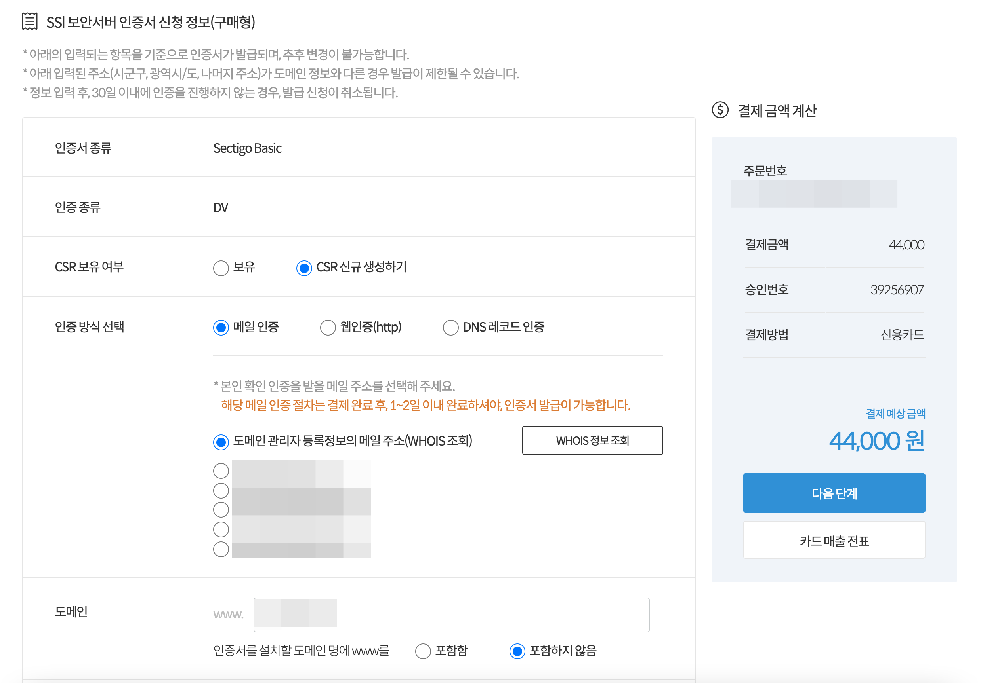
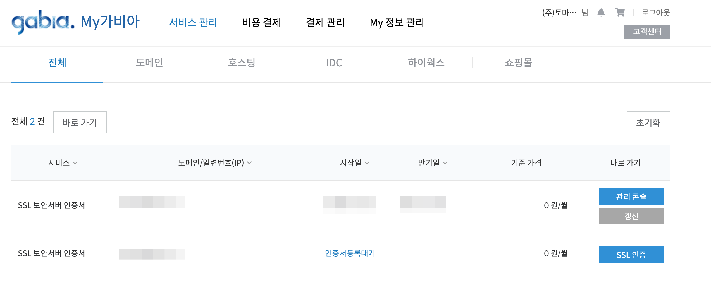
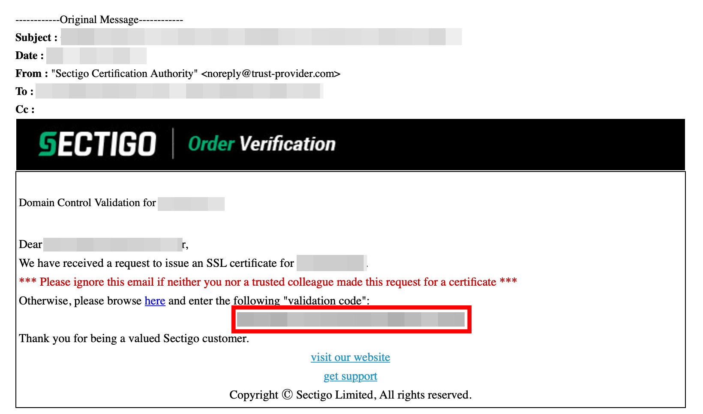
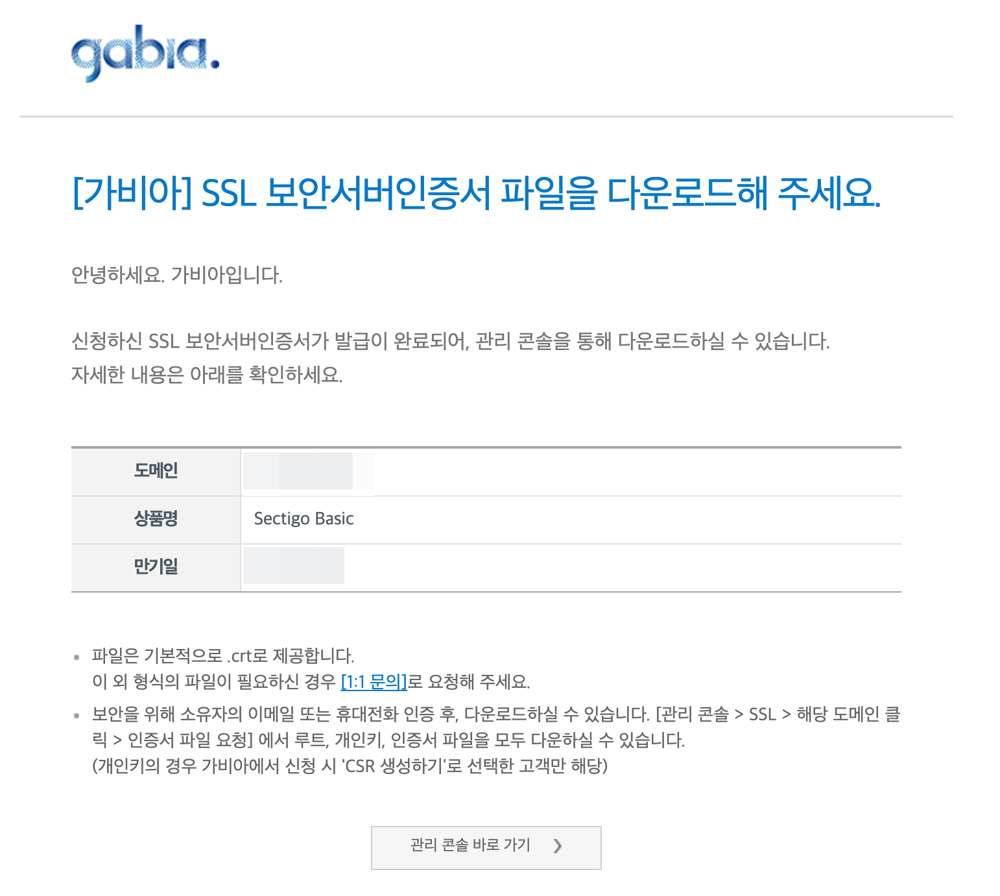
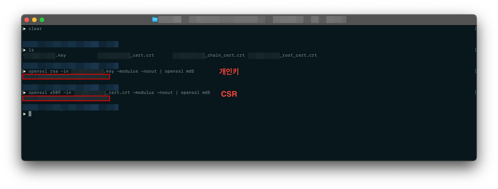
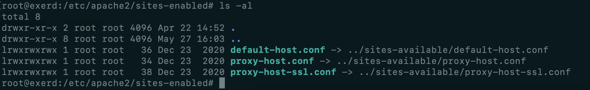
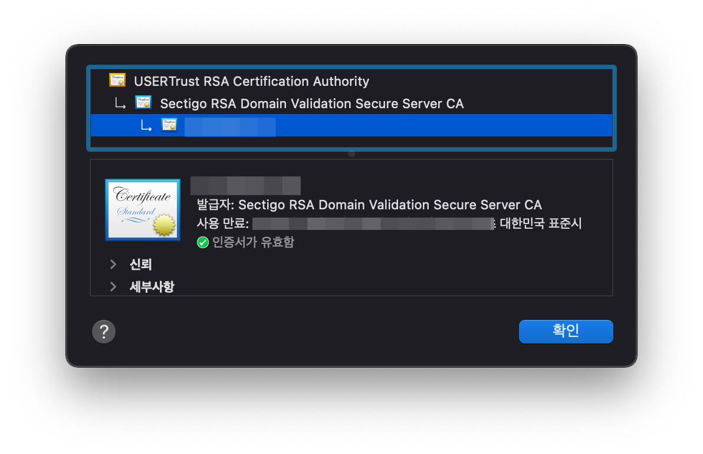

[여기](https://security.googleblog.com/2020/02/protecting-users-from-insecure_6.html)에 따르면 Google은 https로 설정된 웹사이트에서 http 콘텐츠가 포함된 혼합 콘텐츠(Mixed Content)를 차단할 것이라고 예고하였으며, 혼합 콘텐츠의 타입은 Chrome 81부터 순차적으로 차단한다고 하였다.

회사에서 제공하는 애플리케이션의 확장자가 .exe 파일이며, Chrome 83부터는 Block 되어, 이용자들이 애플리케이션을 다운받을 수 없게 된다.

그렇기 때문에 다운로드 서버에 SSL을 적용해야만 했다.

<!--truncate-->

이 애플리케이션을 다운로드받기 위해서는 다음의 과정을 거친다.

1. 이용자는 홈페이지에서 이름, 연락처, 이메일 등을 입력하고 다운로드 버튼을 누른다.
2. 입력한 이메일로 다운로드 링크가 포함된 메일이 도착한다.
3. 메일에서 다운로드를 클릭하여 애플리케이션을 내려받는다.

이때, 사용자가 사용 중인 메일 공급업체의 서버 -> 회사 다운로드 서버로 접근한다.

## 서버 환경
- OS : Ubuntu 18.04.4 LTS
- Apache : Apache/2.4.29

## SSL 인증서 구매
나는 가비아에서 SSL 인증서를 구매하였다. SSL 인증서를 구매할 수 있는 브랜드는 다양했다. (GlobalSign, SECTIGO, Digicert)

회사에서 운영하는 서버 자체가 규모가 크지도 않았고, 가격대별로 제공하는 기능도 거의 같았기 때문에 제일 저렴한 상품을 구매하였다.



CSR은 새로 생성하였고, 도메인은 www로 시작하지 않기 때문에 '포함하지 않음' 옵션을 선택하고 도메인을 입력하였다. 

## 주문 유효성 검증
구매만 할 경우 아래와 같이 **인증서등록대기** 상태로 표시가 된다.



구매하였다면, 5분 이내에 구입시 작성한 메일로 유효성 검증을 위한 메일을 수신할 수 있다.



붉은색 박스로 표시된 **Validation Code**를 복사한 뒤, **here**을 클릭하여 열리는 사이트에 붙여넣어 주문 유효성 검증을 완료한다.

## 인증서 다운로드
주문 유효성 검증을 완료하면 인증서를 다운로드 할 수 있는 메일을 수신할 수 있다. 



관리 콘솔 바로 가기를 클릭하고, 본인 인증 뒤 인증서와 개인키 파일들 다운로드 받는다.

## 인증서 CSR 코드 및 개인키 유효성 검증(생략 가능)
인증서 파일을 다운로드받고, 압축을 풀면 다음의 파일들로 구성된다.

- 도메인_cert.crt
- 도메인_chain_cert.crt
- 도메인_root_cert.crt
- 도메인.key

key 파일과 crt 파일간 유효성 검증을 한다. ~~(생략해도 된다)~~

> key 파일 검증

```
openssl rsa -in 도메인.key -modulus -noout | openssl md5
```

> CSR 파일 검증

```
openssl x509 -in 도메인_cert.crt -modulus -noout | openssl md5
```

두 파일 간의 값이 일치해야 한다.



## 인증서 설치
### 인증서 파일 업로드
다운로드받은 파일들을 적당한 위치로 옮겨준다. 나의 경우 **/usr/share/ca-certficates/도메인/** 경로로 옮겼다. 옮긴 파일들은 다음과 같다

- 도메인_.crt
- 도메인.key
- 도메인_root_cert.crt

### 인증서 설정파일 확인
/etc/apache2/apache2.conf 파일을 열면 **VirtualHost 태그** 가 있는 지 확인한다. 없다면, VirtualHost 관련 설정을 모아 두는 별도의 conf 파일이 있을 수 있다. 나의 경우 다음의 내용을 확인할 수 있었다.

```
# Include the virtual host configurations:
IncludeOptional sites-enabled/*.conf
```
/etc/apache2/sites-enabled 경로로 이동하였다.



/etc/apache2/sites-enabled에 있는 파일들은 /etc/apache2/site-available에 있는 파일들과 심볼릭 링크로 연결되어 있었다.

/etc/apache2/site-available로 이동한다. 이제 설정을 시작한다.

### 인증서 설정
이미 서버에는 SSL 인증서가 설정되어있기 때문에, 만약 인증서를 설치하지 않았다면 현재 구조와 다를 수 있다. 또한 인증서를 설치하려는 서버의 설정에 따라 다를 수 있다. 나의 경우 proxy-host-ssl.conf 파일에 작성하였다.

/etc/apache2/apache2.conf 파일에 **IncludeOptional sites-enabled/*.conf** 가 설정되어있어 
proxy-host-ssl.conf 의 내용이 로드가 된다.

> proxy-host-ssl.conf

```
<IfModule mod_ssl.c>
        <VirtualHost *:443>
                ServerName <도메인 명> (***.com)
                ServerAlias <도메인 별명(중요 x)> (www.***.com)
                ServerAdmin <도메인 관리자 메일주소> (***@###.com)

                ProxyPass / ajp://localhost:8009/
                ErrorLog ${APACHE_LOG_DIR}/<도메인>/ssl-error.log
                CustomLog ${APACHE_LOG_DIR}/<도메인>/ssl-access.log combined

                SSLEngine on
                SSLProtocol all -SSLv2 -SSLv3
                SSLCertificateFile "/usr/share/ca-certificates/<도메인>/도메인_cert.crt"
                SSLCertificateKeyFile "/usr/share/ca-certificates/<도메인>/도메인.key"
                SSLCertificateChainFile "/usr/share/ca-certificates/<도메인>/도메인_root_cert.crt"
        </VirtualHost>
<IfModule>
```
**SSLCertificateFile** Key에는 앞에서 업로드 한 도메인_cert.crt 파일의 경로를 작성한다.
만약, pem 확장자라면, 도메인_cert.pem 파일의 경로를 작성한다.

**SSLCertificateKeyFile** Key에는 도메인.key 파일의 경로를 작성한다.
만약, pem 확장자라면, 도메인_cert.key.pem 파일의 경로를 작성한다.

**SSLCertificateChainFile** Key에는 도메인_root_cert.crt 파일의 경롤를 작성한다.
만약, 발급받은 파일이 Chain_RootCA_Bundle.crt라면, 해당 파일의 경로를 작성한다.

### 서버 재시작
아래의 명령어를 입력하여 서버를 재가동한다.
```
sudo service apache2 restart
```

## 인증서 적용 확인



