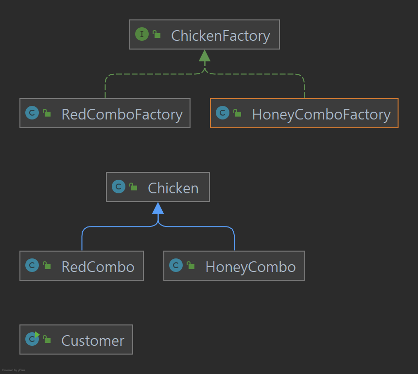

팩토리 메서드 패턴을 줄여서 **팩토리(Factory Pattern)** 이라고 하며, 다른 종류로는 **추상 팩토리 패턴(Abstract Factory Pattern)**이 있다.

팩토리 매서드 패턴은 생성 패턴(Creational Pattern)의 종류 중 하나이며, 자식(하위) 클래스가 어떤 객체를 생성할지 결정하며, 부모 클래스는 자식 클래스로 부터 전달된 인풋에 따라 객체를 생성하여 반환하도록 설계된 패턴이다.

<!--truncate-->

## 사용 이유
그러면 왜 저런 패턴을 써야할까? 간단하게 치킨(Chicken)을 예로 들겠다.

고객이 치킨을 주문 하면 주문을 받고, 치킨의 이름 / 색깔 / 가격등을 기입하고 고객에게 전달한다는 예제 코드이다.

- Customer.java
```java
public class Customer {
    public static void main(String[] args) {
        Chicken honeyCombo = ChickenFactory.orderChicken("허니콤보", "honey@gmail.com");
        System.out.println(honeyCombo);

        System.out.println("=====================================================");
    
        Chicken redCombo = ChickenFactory.orderChicken("레드콤보", "red@gmail.com");
        System.out.println(redCombo);
    }
}
```

- Chicken.java

```java
public class Chicken {

    private String name;

    private String price;

    private String color;

    public String getName() {
        return name;
    }

    public void setName(String name) {
        this.name = name;
    }

    public String getPrice() {
        return price;
    }

    public void setPrice(String price) {
        this.price = price;
    }

    public String getColor() {
        return color;
    }

    public void setColor(String color) {
        this.color = color;
    }

    @Override
    public String toString() {
        return "Chicken [name=" + name + ", price=" + price + "]";
    }
}
```

- ChickenFactory
```java
public class ChickenFactory {
    public static Chicken orderChicken(String name, String email) {
        if (name == null || name.isEmpty()) {
            throw new IllegalArgumentException("치킨 이름을 지어주세요.");
        }
        if (email == null || email.isEmpty()) {
            throw new IllegalArgumentException("연락처를 남겨주세요.");
        }

        prepareFor(name);

        Chicken chicken = new Chicken();
        chicken.setName(name);

        // 치킨 색깔
        if (name.equalsIgnoreCase("허니콤보")) {
            chicken.setColor("gold");
        } else if (name.equalsIgnoreCase("레드콤보")) {
            chicken.setColor("red");
        }

        // 치킨 가격
        if (name.equalsIgnoreCase("허니콤보")) {
            chicken.setPrice("18,000원");
        } else if (name.equalsIgnoreCase("레드콤보")) {
            chicken.setPrice("19,000원");
        }

        // notify
        sendEmailTo(email, chicken);

        return chicken;
    }

    private static void sendEmailTo(String email, Chicken chicken) {
        System.out.println(chicken.getName() + "를 다 만들었습니다.");
    }

    private static void prepareFor(String name) {
        System.out.println(name + " 만들 준비 하는 중...");
    }
}
```

지금은 메뉴가 두 가지 이지만, '블랙시크릿오리지날' 이라는 신 메뉴가 나왔다고 가정하고, 가격은 3만원이라고 하자. 그리고, '블랙시크릿오리지날' 메뉴를 주문한 고객이 있다면
Customer 클래스에서는 ChickenFactory로 요청을 할 것이고, 현재 상황에서 ChickenFactory 클래스는 다음과 같이 수정되어야 할 것이다.

- ChickenFactory.java(신 메뉴 추가 시)

```java
public class ChickenFactory {
    public static Chicken orderChicken(String name, String email) {
       ... 생략
        
        // 치킨 색깔
        if (name.equalsIgnoreCase("허니콤보")) {
            chicken.setColor("gold");
        } else if (name.equalsIgnoreCase("레드콤보")) {
            chicken.setColor("red");
        }  else if (name.equalsIgnoreCase("블랙시크릿오리지날")) {
            chicken.setColor("black");
        }

        // 치킨 가격
        if (name.equalsIgnoreCase("허니콤보")) {
            chicken.setPrice("18,000원");
        } else if (name.equalsIgnoreCase("레드콤보")) {
            chicken.setPrice("19,000원");
        }else if (name.equalsIgnoreCase("블랙시크릿오리지날")) {
            chicken.setPrice("23,000원");
        }
    ... 생략
    }

  ... 생략
}
```

> 결과

```console
허니콤보 만들 준비 하는 중...
허니콤보를 다 만들었습니다.
Chicken [name=허니콤보, price=18,000원]
=====================================================
레드콤보 만들 준비 하는 중...
레드콤보를 다 만들었습니다.
Chicken [name=레드콤보, price=19,000원]
```

객체지향 원칙에는 **Open-closed priniple** 라는 용어가 있는데, 확장에는 열려있고, 변경에는 닫혀있어야 한다는 뜻이다. 위와 같이 어떤 요구사항이 변경됨으로써 기존 코드가 변경이 되는(= 변경에 닫혀있지 않은) 상태가 되면 안된다.

## 팩토리 메서드 패턴 적용
먼저 ChickenFactory 클래스가 하는 업무가 너무 많다.
- 치킨 이름의 누락여부 체크 
- 연락처 누락 여부 체크
- 치킨 이름 정하기
- 치킨 색깔 정하기
- 치킨 가격 정하기
- 고객에게 알리기

여기서 공통으로 뺄 수있는 항목들만 ChickenFactory 클래스에 유지 시키고 일부를 수정한다.

- ChickenFactory.java

```java
public interface ChickenFactory {
    default Chicken orderChicken(String name, String email) {
        validate(name, email); // 기존의 치킨 이름과 연락처 누락 여부를 담당하는 메서드
        prepareFor(name);
        Chicken chicken = cookChicken();
        sendEmailTo(email, chicken);
        return chicken;
    }

    private void validate(String name, String email) {
        if (name == null || name.isEmpty()) {
            throw new IllegalArgumentException("치킨 이름을 지어주세요.");
        }
        if (email == null || email.isEmpty()) {
            throw new IllegalArgumentException("연락처를 남겨주세요.");
        }
    }

    private void prepareFor(String name) {
        System.out.println(name + " 만들 준비 하는 중...");
    }

    Chicken cookChicken(); // Private Method나 Default Method로 정의하지 않았기 때문에 반드시 하위클래스가 정의를 해줘야한다.

    private void sendEmailTo(String email, Chicken chicken) {
        System.out.println(chicken.getName() + "를 다 만들었습니다.");
    }
}
```

이제 허니콤보든 레드콤보든 어떤 치킨이든 주문받고, 유효성 검증하고, 고객에게 알리는 역할은 ChickenFactory클래스에서 하고, 허니콤보를 생성할 땐 허니콤보에만 집중하면 되고, 레드콤보를 생성할 땐 레드콤보에만 집중하면 된다.

아래와 같이 HoneyComboFactory, RedComboFactory 클래스를 새로 생성하고, ChickenFactory 인터페이스를 implements 하도록 작성한다. 그리고, 인터페이스에서 정의되지않은 cookChicken()을 아래 두 클래스에서 호출하도록한다.

> HoneyComboFactory.java

```java
public class HoneyComboFactory implements ChickenFactory{

    @Override
    public Chicken cookChicken() {
        return new HoneyCombo();
    }

    // 허니콤보를 만드는 공장만의 새로운 무언가가 생길 수 있음.
}
```

> RedComboFactory.java

```java
public class RedComboFactory implements ChickenFactory{

    @Override
    public Chicken cookChicken() {
        return new RedCombo();
    }

    // 레드콤보를 만드는 공장만의 새로운 무언가가 생길 수 있음.
}
```

위 코드로 보아 HoneyComboFactory는 허니콤보를, RedComboFactory는 레드 콤보를 요리 한다는것을 알 수 있다.

이제 각 치킨별 이름, 색갈 가격을 나타내는 클래스를 생성한다.

> HoneyCombo.java

```java
public class HoneyCombo extends Chicken{

    public HoneyCombo(){
        setName("허니콤보");
        setColor("gold");
        setPrice("18,000원");
    }
}
```

> RedCombo.java

```java
 public RedCombo(){
        setName("레드콤보");
        setColor("red");
        setPrice("19,000원");
    }
```

그리고 이를 주문하는 Customer 클래스를 다음과 같이 수정한다.

> Customer.java

```java
public class Customer {
    public static void main(String[] args) {
        Chicken honeyCombo = new HoneyComboFactory().orderChicken("허니콤보", "honey@gmail.com");
        System.out.println(honeyCombo);

        System.out.println("=====================================================");
      
        Chicken redCombo = new RedComboFactory().orderChicken("레드콤보", "red@gmail.com");
        System.out.println(redCombo);
    }
}
```

위와 같이 수정하였을 경우 새로운 치킨이 추가되면, 그 치킨의 Factory와 그 치킨의 이름, 색깔, 가격을 지정할 클래스만 생성하면 된다.

하지만 새로운 치킨이 추가될 때마다 Client 코드(Customer 클래스)는 계속 변경이 된다. 만약 새로운 치킨을 주문하고 싶다면, 그 치킨을 주문하기 위한 Factory 클래스를 알아야만 한다.

아래와 같이 HoneyComboFactory 클래스와 RedComboFactory클래스를 의존성 주입을 함으로써 Client 변경을 최소화 할 수 있다.

> Customer.java

```java
public class Customer {
    public static void main(String[] args) {

        Customer customer = new Customer();
        customer.print(new HoneyComboFactory(), "허니콤보", "honey@gmail.com");
        System.out.println("=====================================================");
        customer.print(new RedComboFactory(), "레드콤보", "red@gmail.com");

    }

    private void print(ChickenFactory chickenFactory, String name, String email) {
        System.out.println(chickenFactory.orderChicken(name,email));
    }
}
```

팩토리 메서드 패턴을 적용한 뒤 다이어그램은 아래와 같다.




## 주의점
위 코드는 JAVA 11을 기준으로 작성되었다. 만약 JAVA 8을 사용한다면 인터페이스(ChickenFactory.java)에 private method를 사용할 수 없다.

인터페이스에 Private Method는 JAVA 9부터 사용할 수 있다.

JAVA 8를 사용한다면 다음과 같이 수정한다.

ChickenFactory 클래스에서 private 메서드로 작성한것들을 선언부만 남긴다.

> ChickenFactory.java

```java
public interface ChickenFactory {
    default Chicken orderChicken(String name, String email) {
        validate(name, email);
        prepareFor(name);
        Chicken chicken = cookChicken();
        sendEmailTo(email, chicken);
        return chicken;
    }

    void validate(String name, String email) ;

    void prepareFor(String name);

    Chicken cookChicken();

    void sendEmailTo(String email, Chicken chicken);
}
```

그리고 기존 ChickenFactory 인터페이스에서 구현해놨던 부분을 DefaultChickenFactory 라는 추상 클래스를 생성하여 아래와 같이 작성한다.

> DefaultChickenFactory.java

```java
public abstract class DefaultChickenFactory implements ChickenFactory {
    @Override
    public void prepareFor(String name) {
        System.out.println(name + " 만들 준비 하는 중...");
    }

    @Override
    public void sendEmailTo(String email, Chicken chicken) {
        System.out.println(chicken.getName() + "를 다 만들었습니다.");
    }

    @Override
    public void validate(String name, String email) {
        if (name == null || name.isEmpty()) {
            throw new IllegalArgumentException("치킨 이름을 지어주세요.");
        }
        if (email == null || email.isEmpty()) {
            throw new IllegalArgumentException("연락처를 남겨주세요.");
        }
    }
}
```

그리고 ChickenFactory를 implements 하도록 작성한 HoneyComboFactory 클래스와 RedComboFactory 클래스들을 DefaultChickenFactory 클래스를 상속받도록 수정한다.

> HoneyComboFactory.java

```java
public class HoneyComboFactory extends DefaultChickenFactory {

    @Override
    public Chicken cookChicken() {
        return new HoneyCombo();
    }

    // 허니콤보를 만드는 공장만의 새로운 무언가가 생길 수 있음.
}
```

> RedComboFactory.java

```java
public class RedComboFactory extends DefaultChickenFactory {

    @Override
    public Chicken cookChicken() {
        return new RedCombo();
    }

    // 레드콤보를 만드는 공장만의 새로운 무언가가 생길 수 있음.
}
```

## 팩토리 메서드 패턴 장점
- 기존 코드를 수정하지 않고, 새로운 인스턴스를 다른 방법으로 확장이 가능하다. Creater와 Factory간의 관계가 느슨한 결합(Loose coupling)으로 되어있기 때문이다. 이로 인해 확장에는 열려있고 변경에 닫혀있는 객체 지향 원칙을 준수할 수 있다.

## 팩토리 메서드 패턴 단점
각자의 역할이 나뉘어지다보니 클래스가 많아지는 단점이 있다.

## 정리
1. 확장에는 열려있고 변경에 닫혀있는 객체 지향 원칙 이란?
> 기존 코드를 변경하지 않으면서, 새로운 기능을 얼마든지 확장할 수 있는 구조로 만드는것을 의미한다.

2. Java 8에 추가된 default 메서드란?
> Java 8 이전에는 인터페이스에 추상 메서드만 정의할 수 있었고, 이 인터페이스를 구현하는 클래스에서 해당 메서드를 구현하거나 추상 클래스로 만드는 방법 뿐이였으나, Java 8부터는 인터페이스에 기본 구현체를 만들 수 있게 되어, 그 인터페이스를 구현하는 클래스 혹은 그 인터페이스를 상속받은 또 다른 인터페이스도 해당 기능을 사용할 수 있게 되었다.