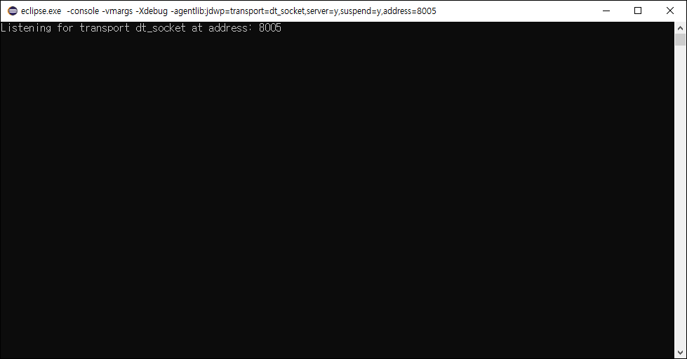
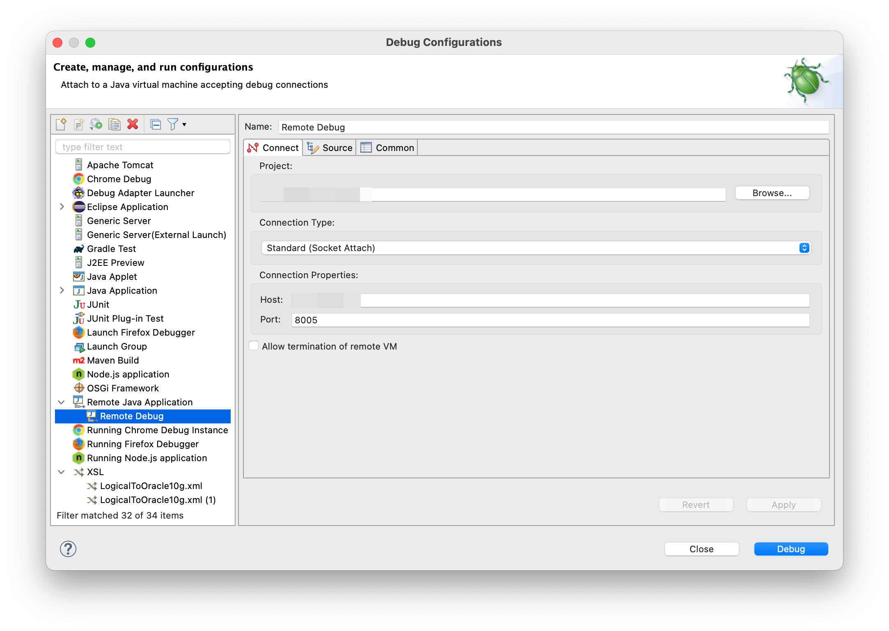
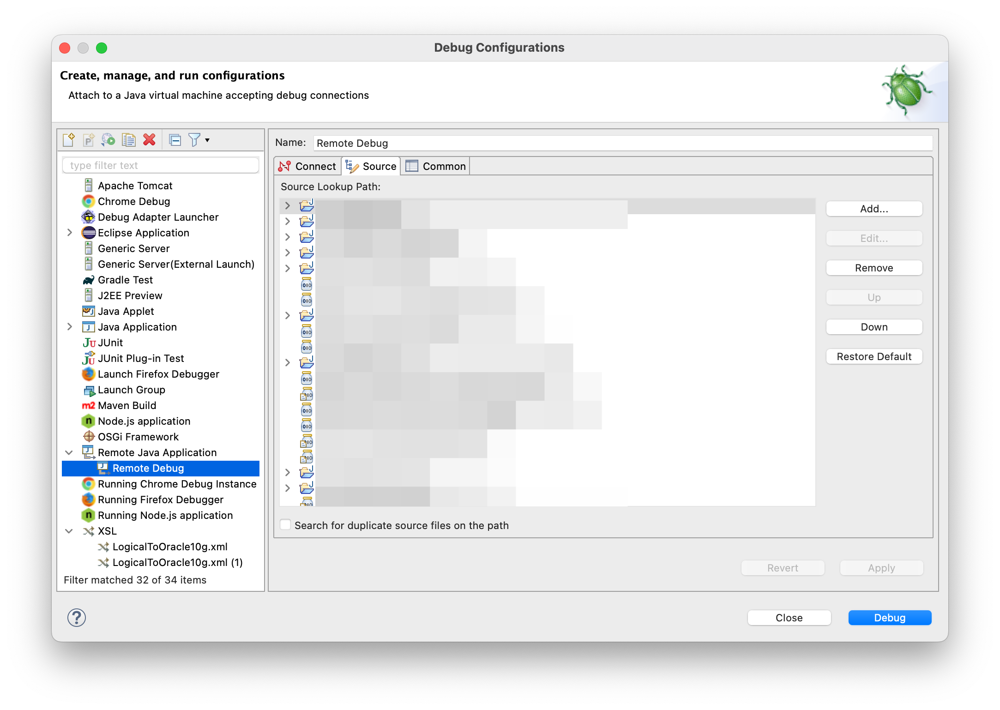
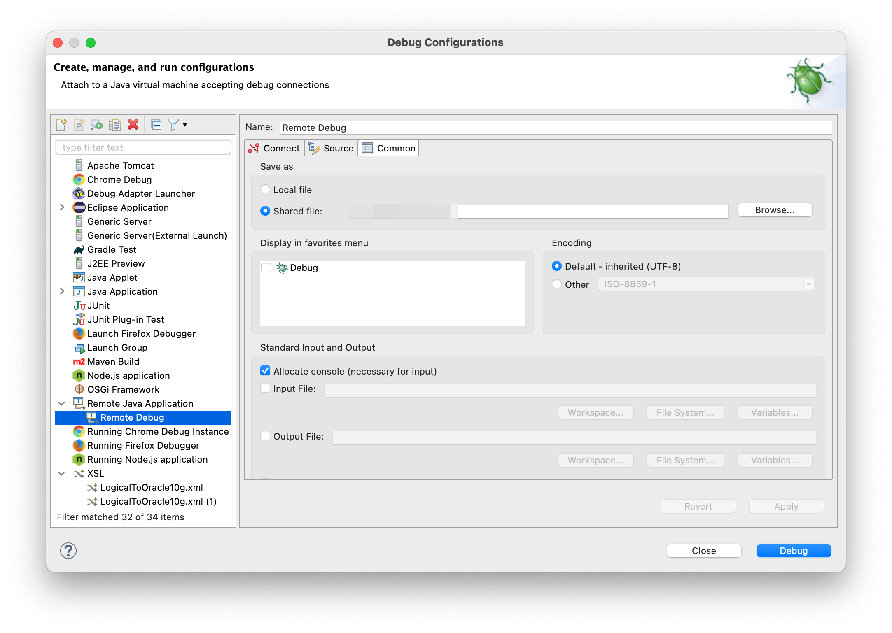
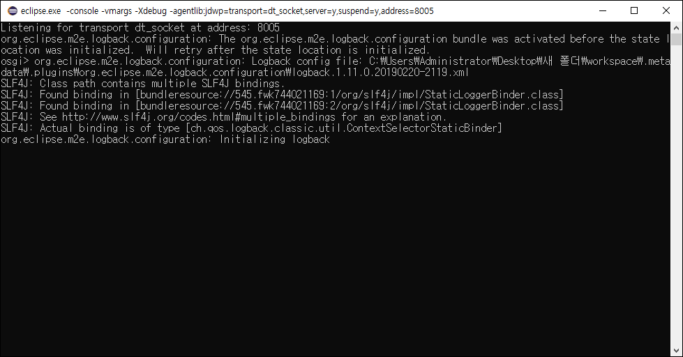
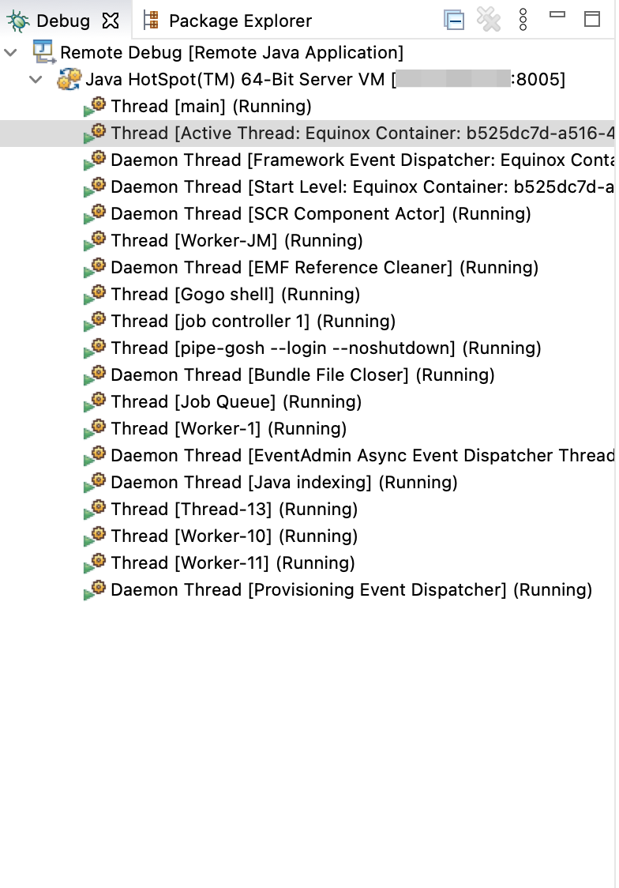

# Eclipse Remote Debugging

## 개요
Eclipse IDE를 사용하면 다른 JVM(Java Virtual Machine) 또는 다른 시스템에서 실행되는 애플리케이션을 디버그할 수 있다.

<!--truncate-->
## 사용 이유
본인의 경우 Local 개발 환경에서 발견하지 못한 버그가 다른 시스템에서 발견 되었을 때, Local 개발 환경을 변경하기에 많은 비용이 발생 하거나, 테스트 케이스가 정확하지 않아 재현하기 어려울 때 사용하였다. 

## (1) 원격지 Listening
```
eclipse.exe -console -vmargs -Xdebug -agentlib:jdwp=transport=dt_socket,server=y,suspend=y,address=8005
```


## (2) Remote Debug Configuration
Debugging하려는 Eclipse의 Debug Configuration > Remote Java Application에서 Configuration을 추가하고,
아래와같이 설정한다.



만약, 원격지의 특정 Project에 대해 Remote Debugging하려면 RemoteConfiguration의 Source 탭에서 관련 Project를 추가한다.





## (3) Remote Debug
Debug를 누르면 Suspend 상태이던 Target Eclipse가 실행된다



그리고 Remote Debug Eclipse에서는 Target Eclipse에 대한 Debug Stack을 확인할 수 있다.


