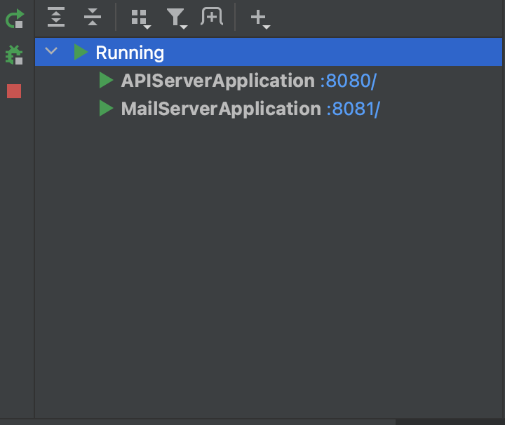

# IntelliJ 멀티 모듈 구성

## 개요
어떤 시스템을 개발할 때, 애플리케이션 서버, 메일 서버, 인증 서버 등 기능별로 프로젝트를 구성하게 된다.

여러 개의 프로젝트를 어떻게 관리를 할 수 있을지, 하나의 프로젝트 내에서 관리할 수는 없을지에 대해 고민하였고, 멀티 모듈이라는 개념을 알게 되었다.

멀티 모듈에 대한 자세한 내용은 [여기](https://techblog.woowahan.com/2637/)에 잘 설명이 되어있으며, 이 게시물에서는 IntelliJ에서 프로젝트를 멀티 모듈로 구성하는 방법에 대해서만 작성한다.

<!--truncate-->

이 게시물의 내용은 [개인 프로젝트](https://github.com/wallybum/e-commerce-master.git)를 진행하면서 구성한 멀티모듈 프로젝트 초기에 관한 내용이며, 향후 개인 프로젝트의 구성과 이 글의 내용은 달라질 수 있다.


## 프로젝트 생성
IntelliJ > File > New Project에서 New Project를 선택하고 환경을 구성한다.
개인 프로젝트에서는 SpringBoot 3. X를 사용할 것이므로 최소 버전인 JDK 17을 선택하였다.


## src 디렉터리 제거
e-commerce-master 프로젝트 내의 모듈을 구성할 것이므로, SRC 디렉터리가 필요 없으므로 제거하였다.


## 첫번째 모듈 추가
프로젝트 우클릭 > New > Module을 하여 모듈을 추가한다.


## 디펜던시 추가
모듈 추가 후 나타나는 화면에서 필요한 디펜던시들을 추가한다.


## 두번째 모듈 추가
동일한 방법으로 모듈을 추가한다. 디펜던시도 적절한걸 선택한다.


## 프로젝트 구조 확인
모듈을 추가하면 프로젝트는 아래와 같은 구조가 된다.


## 프로젝트 설정

### 1. 루트 프로젝트에 모듈 Include 설정
루트 프로젝트(e-commerce-master)의 **settings.gradle.kts**파일에 아래와 같이 설정한다.

```
rootProject.name = "e-commerce-master"

include("app:api-server")
include("app:mail-server")
```

이 설정은 프로젝트를 빌드할 때 포함할 모듈을 명시하는 것으로, 모듈을 생성하였더라도, include 설정하지 않으면 빌드 대상에서 빠진다.

### 2. Gradle Build Script 작성
> 루트 모듈 build.gradle.kts

```
import org.gradle.kotlin.dsl.version

plugins {
    id("java")
    id("org.springframework.boot") version "3.0.6"
    id("io.spring.dependency-management") version "1.1.0"
}

group = "com.ecommerce"
version = "1.0-SNAPSHOT"

repositories {
    mavenCentral()
}
subprojects {
    apply{
        plugin("org.springframework.boot")
        plugin("io.spring.dependency-management")
    }
    repositories {
        mavenCentral()
    }

    dependencies{
    }
}
```

> API-Server 모듈 build.gradle.kts

```
plugins {
	java
	id("org.springframework.boot") version "3.0.6"
	id("io.spring.dependency-management") version "1.1.0"
}

group = "com.ecommerce"
version = "0.0.1-SNAPSHOT"
java.sourceCompatibility = JavaVersion.VERSION_17

configurations {
	compileOnly {
		extendsFrom(configurations.annotationProcessor.get())
	}
}

repositories {
	mavenCentral()
}

dependencies {
	implementation("org.springframework.boot:spring-boot-starter-thymeleaf")
	implementation("org.springframework.boot:spring-boot-starter-web")
	implementation("org.springframework.boot:spring-boot-starter-web-services")
	compileOnly("org.projectlombok:lombok")
	annotationProcessor("org.projectlombok:lombok")
}
```

> Mail-Server 모듈 build.gradle.kts

```
plugins {
	java
	id("org.springframework.boot") version "3.0.6"
	id("io.spring.dependency-management") version "1.1.0"
}

group = "com.ecommerce"
version = "0.0.1-SNAPSHOT"
java.sourceCompatibility = JavaVersion.VERSION_17

configurations {
	compileOnly {
		extendsFrom(configurations.annotationProcessor.get())
	}
}

repositories {
	mavenCentral()
}

dependencies {
	implementation("org.springframework.boot:spring-boot-starter-thymeleaf")
	implementation("org.springframework.boot:spring-boot-starter-web")
	implementation("org.springframework.boot:spring-boot-starter-web-services")
	compileOnly("org.projectlombok:lombok")
	annotationProcessor("org.projectlombok:lombok")
}
```

### 3. 모듈 별 포트번호 지정
여러개의 모듈 구성 후 서버를 실행하면 SpringBoot 내장 톰캣에 의해 8080포트가 부여된다. 하지만 여러개의 모듈을 실행할 때 나중에 로드된 모듈에도 8080포트가 부여되어 포트번호가 중복되어 접속할 수 없는 문제가 발생한다.
따라서, 각 모듈의 application.properties에 각 포트번호를 지정한다.

> API-Server 모듈 application.properties
```
server.port=8080
```

> Mail-Server 모듈 application.properties
```
server.port=8081
```

## Controller 작성
각 모듈의 Controller를 작성한다.

> API-Server Module

```java
package com.ecommerce.apiserver.controller;

import org.springframework.web.bind.annotation.GetMapping;
import org.springframework.web.bind.annotation.RestController;

@RestController
public class APIServerController {
    @GetMapping("/APIServer")
    public String APIServer(){
        return "Hello APIServer";
    }
}
```

> Mail-Server Module

```java
package com.ecommerce.mailserver.controller;

import org.springframework.web.bind.annotation.GetMapping;
import org.springframework.web.bind.annotation.RestController;

@RestController
public class MailServerController {
    @GetMapping("/MailServer")
    public String MailServer(){
        return "Hello MailServer";
    }
}
```

## 서버 실행
서버 실행 후 두 모듈이 정상적으로 실행되었다면 아래와 같이 표시된다.



만약 둘 중 하나만 실행된 상태라면 RunConfiguration에서 모듈이 모두 추가 되어있는지 확인한다. 


## 실행 결과

