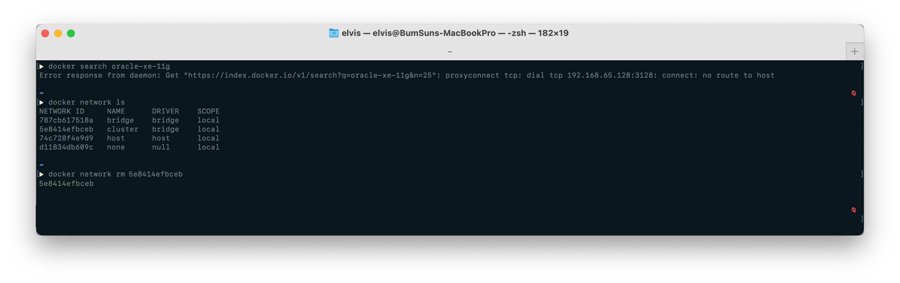

# Docker - no route to host

## 서버 환경
- OS : Mac OS Ventura 13.0.1
- 컨테이너 : Docker 4.14.1

## 개요
기존 Docker 4.2.X(2021.11월 릴리즈) 를 사용하다가, Docker 업데이트를 진행하였다. 업데이트를 마친 후 필요한 도커 이미지를 다운받으려고 시도하였으나, 접속이 되지 않는 문제가 발생하였다.

## 오류 발생
```console
➡︎ docker search oracle-xe-11g
Error response from daemon: Get "https://index.docker.io/v1/search?q=oracle-xe-11g&n=25": proxyconnect tcp: dial tcp 192.168.65.128:3128: connect: no route to host
``` 

위 오류를 검색해보니 다음과 같은 해결책을 확인할 수 있었다.

- Docker 컨테이너에서 Host로 가는 트래픽이 제한되고 있으므로, 방화벽 규칙 수정.

- Docker 환결설정에서 bridge network 대역을 변경 (bip 설정)

## 해결
stackoverflow에서 저명성이 있는 사람들이 위에 대한 해결책을 제시하였으나, Docker 업데이트 전에는 발생하지 않던 문제가 업데이트 후 오류가 발생하였기 때문에, 현재 상황에서는 제시된 해결책이 적용되지 않는다고 생각하였다.

Docker Hub에 접속이 안되기 때문에, 먼저 Docker에 설정된 네트워크 인터페이스를 확인하였다.

```console
▶ docker network ls
NETWORK ID     NAME      DRIVER    SCOPE
787cb617518a   bridge    bridge    local
5e8414efbceb   cluster   bridge    local
74c728f4e9d9   host      host      local
d11834db609c   none      null      local
```

Docker에 대한 클러스터 설정을 하지 않았음에도, 클러스터 네트워크 인터페이스가 브릿지 모드로 설정된것을 확인하였다. 

해당 네트워크를 제거하여 해결하였다.


