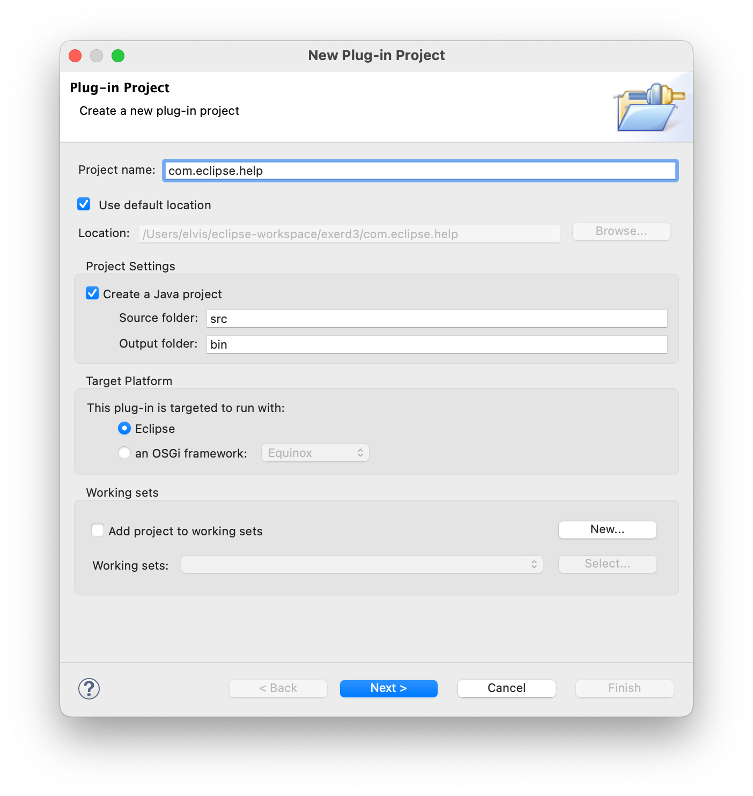
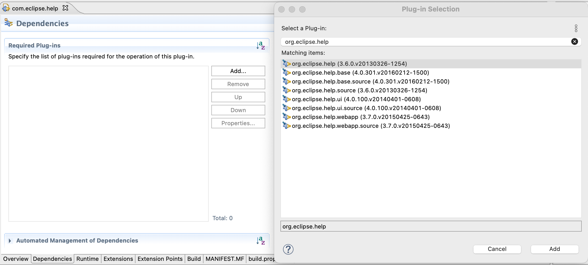
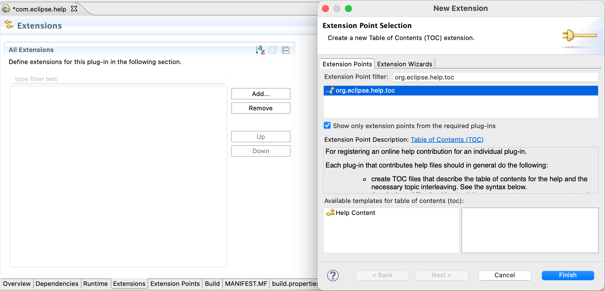
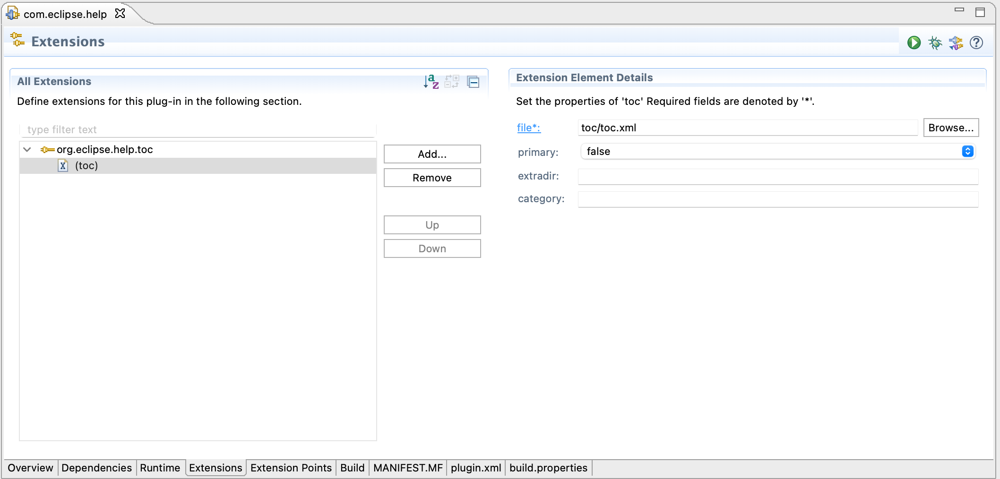
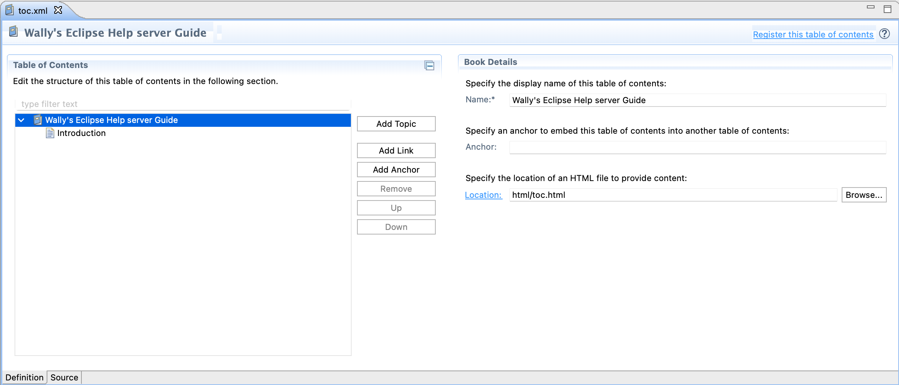
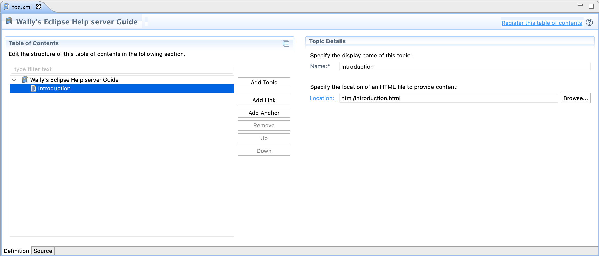
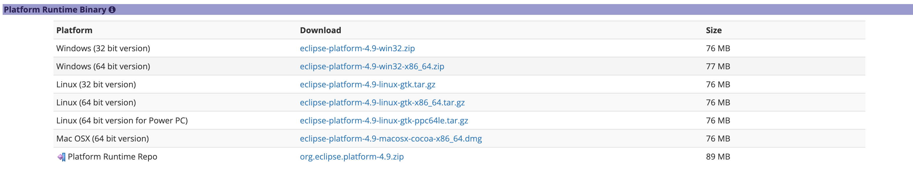
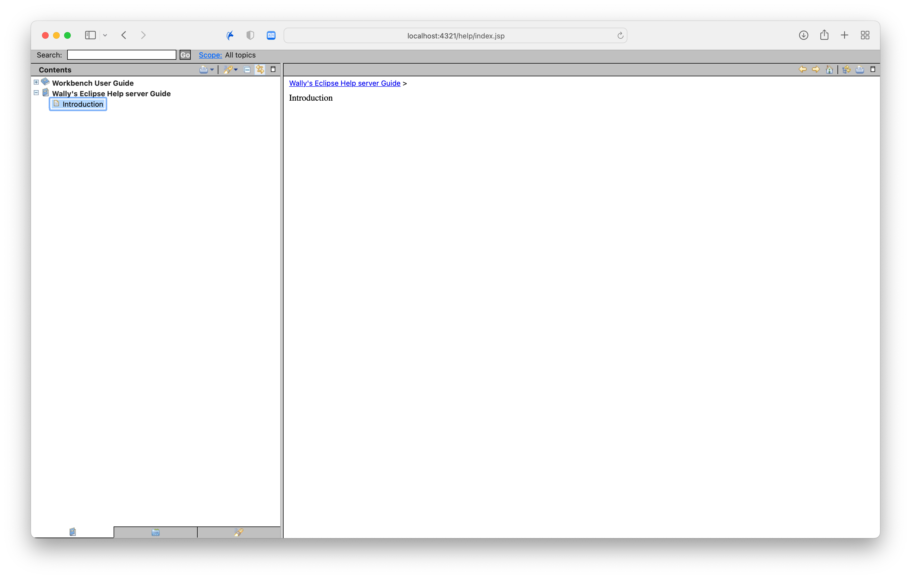

# Eclipse Help server 구성

## 서버 환경
- OS : MacOS Montery(12.4)
- Java : 8
- Eclipse : 4.9(2018-09)

## 도움말 프로젝트 구성
### Plug-in 프로젝트 생성
Eclipse에서 Plug-in 프로젝트를 생성한다. Plug-in Project를 생성하기 위해서는Eclipse Modeling Tools 패키지를 이용해야 한다.



### Dependency 추가
앞에서 생성한 프로젝트의 plugin.xml 파일의 Dependencies 탭에서 아래 그림과 같이 **org.eclipse.help** 디펜던시를 추가한다.



### Extension 설정
앞에서 생성한 프로젝트의 plugin.xml 파일의 Extensions 탭에서 아래 그림과 같이 **org.eclipse.help.toc** extension을 추가한다.



### TOC 설정
추가된 org.eclipse.help.toc extension을 선택하고 우클릭 > toc를 클릭하여 toc를 추가한다.
추가된 toc를 선택하고 우측 Extension Element Details 메뉴에서 toc로 사용할 파일의 경로를 미리 지정한다. 본인 편하게 toc/toc.xml로 하였다.


toc.xml 파일을 생성하고 우클릭 > Open With... > Table of Contents Editor 에디터로 열면 아래 그림과 같이 전용 Editor를 볼 수 있다.

전용 에디터로 열면 처음에는 **An error was encountered while parsing the table of contents' XML file** 이라는 오류가 발생하는데, 이는 toc를 구성하는 가장 최상단의 객체(Book)에 대한 정보가 없기 때문이다. **Book Details**에서 Name 필드와 Location 필드를 구성해주고, xml 파일을 다시 열면된다.

그 다음 Add Topic를 눌러 Topic를 추가하고 적당한 이름을 작성한다.






### 프로젝트 Export
프로젝트 우클릭 > Export > Plug-on Development > Deployable plug-ins and fragments를 선택한다.
## Infocenter 개요
Infocenter는 사용자에게 **도움말 컨텐츠**를 표시하는 역할을 하는 구성 요소이다. 도움말 컨첸츠는 Eclipse에서 사용자를 위해 지원하는 기능 중 하나이며, 일반적으로 **도움말 컨텐츠** 가 주요 기능이다.

### Infocenter Eclipse 다운로드
[여기](https://archive.eclipse.org/eclipse/downloads/)에서 Archived된 버전의 Eclipse를 선택 한다.

버전을 선택하였다면, 스크롤 내려 Platform Runtime Binary 항목에서 운영체제와 CPU 아키텍처와 호환되는 Eclipse를 다운로드 한다.


참고로, 이 문서를 작성하는 시점에서 크롬 브라우저에서는 다운로드가 진행되지 않는다.
이유는 Archive 사이트는 SSL이 적용되어 https 프로토콜을 사용하지만, Archive 사이트 내에 연결되어있는 링크는 http로 되어 있다. Chrome 80버전 이후로 https 홈페이지에서 http 자원 접근을 차단하기 때문이다.

### Windows Infocenter 구성
1. 적절한 경로에 Infocenter 라는 디렉터리를 하나 만든다.
2. 다운받은 파일을 압축 해제 하고, 결과물을 Infocenter 디렉터리로 옮긴다.

### MacOS Infocenter 구성
1. 적절한 경로에 Infocenter 라는 디렉터리를 하나 만든다.
2. dmg 확장자 열기 후 Eclipse.app 파일에 대해 '패키지 내용 보기'를 클릭한다. Contents 디렉터리 안에있는 Eclipse 디렉터리만 Infocenter 디렉터리로 옮긴다. 

### 출판된 플러그인 복제
앞에서 export한 플러그인을 Infocenter 디렉터리 안의 Plugins 디렉터리로 옮긴다.
현재 구조는 다음과 같다.

```bash
├── _CodeSignature
├── Eclipse
│   ├── artifacts.xml
│   └── configuration
│   └── dropins
│   └── eclipse.ini
│   └── features
│   └── p2
│   └── plugins
│   │   ├── org.apache.*.jar
│   │   └── org.eclipse.*.jar
│   │   └── 출판한 jar
│   │   └── ...
│   └── readme
├── Info.plist
├── MacOS
│   ├── eclipse
├── Resources
│   ├── Eclipse.icns
```
### Infocenter 실행 스크립트 작성
Windows는 bat 확장자를, Mac은 sh 확장자를 가지는 파일을 생성하고 아래와 같이 작성한다.

```bash
#!/bin/bash

# Adapt these to your needs. JAVA_CMD should point to the java executable, not the Java home directory.
PORT=4321
JAVA_CMD=/usr/bin/java

echo "Starting up infocenter at http://localhost:${PORT}/help/index.jsp"
cd eclipse

HELP_BASE_JAR_FILE=$(basename ./plugins/org.eclipse.help.base*)
$JAVA_CMD -classpath plugins/${HELP_BASE_JAR_FILE} org.eclipse.help.standalone.Infocenter -vm $JAVA_CMD -noexec -command start -eclipsehome . -port ${PORT} -clean
```

## 스크립트 실행 및 확인
작성한 스크립트 파일을 실행한 뒤, localhost:4321/help/index.jsp로 접속한다.

아래와 같이 TOC가 생성된것을 확인할 수 있다.


